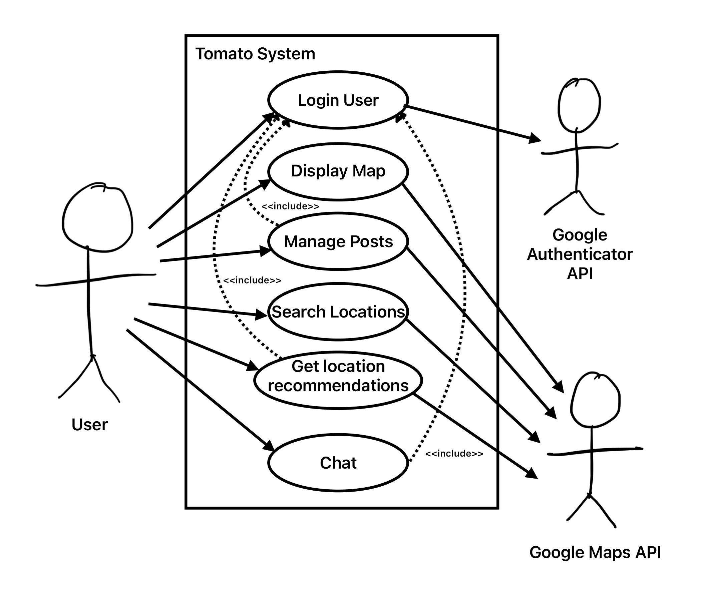
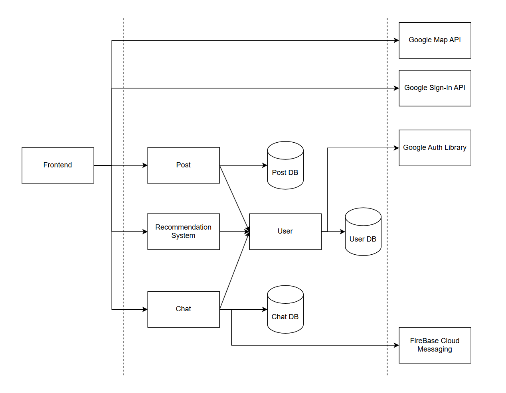
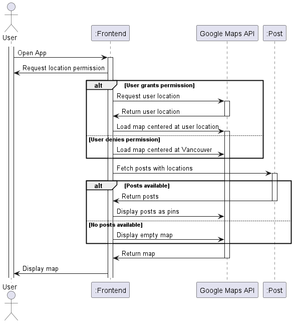
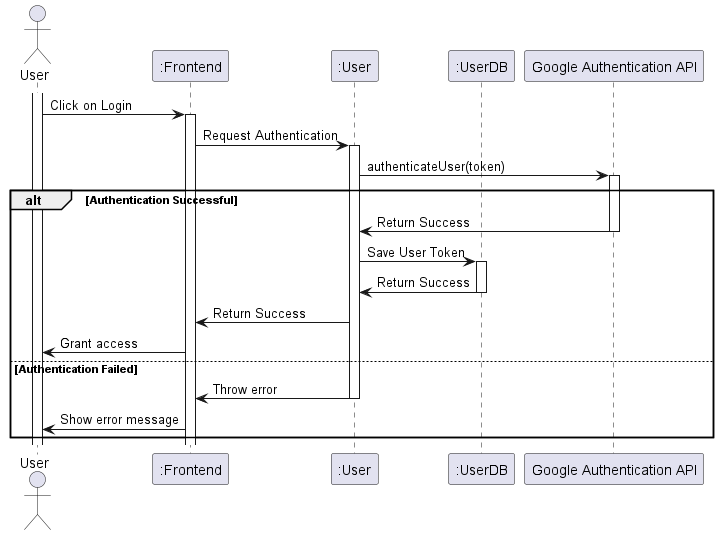
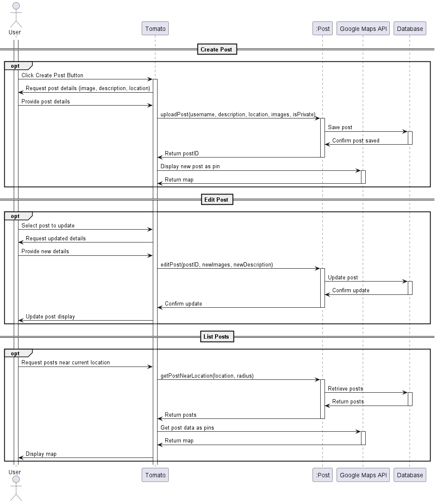
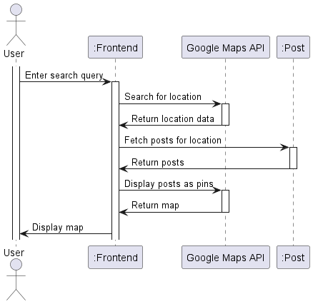
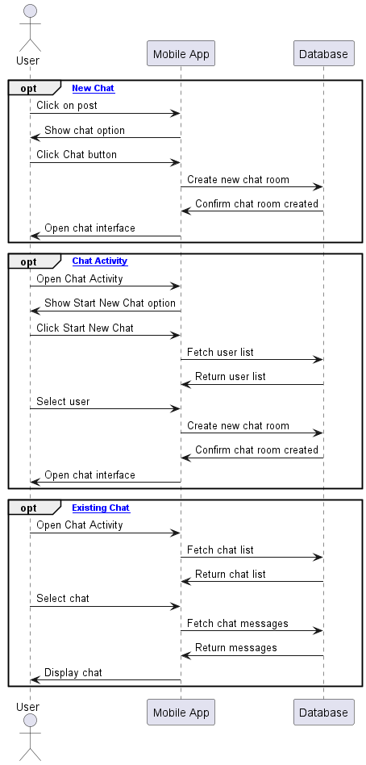

# M3 - Requirements and Design

## 1. Change History
- 3.4 Non Functional Requirement: 2/22/2025
      - We previously mentioned that there must never be more than 10 pins on the map at any given time to avoid cluttering the map. However, removing pins from the map/limiting them will definitely make the app lose information and users would suffer from that loss of information. Therefore, we make it less restrictive where pins must not block other pins making them unclickable -- If they are too close together, cluster them into a single clickable pin. Using this clustering algorithm, we could obtain the original goal of avoiding cluttering the map while also preserving information for the users.
|
- 3.3 Functional Requirements (Recommendation): 3/1/2025
      - The recommendation was originally thought to be part of a filter, where user can opt to show or don't show the recommended posts on the map. However, we then realize the control is too cluttered if recommendation is in the filter. It would have a better separation of concern if there is a dedicated recommendation section that shows all recommended posts for the user, and this will be located in the Profile Page.
- 4.1 Main Components: 2/25/2025 
      - Previously, to obtain posts, there were only single /posts routes and this includes obtaining private and public posts. However, this is unsecure because users may exploit this by changing query param and obtain private posts of others. Therefore, we separate posts into /posts and /posts-authenticated where /posts is used by non-authenticated user and can only obtain public posts. On the other hand, /posts-authenticated can be used to obtain private posts but only the posts from the requesting user.

- 3.3 Functional Requirements (Chat): 3/2/2025 
      - To trigger chat, previously we named the button as "Chat", but we think it would be more descriptive to rename it as "Send Message".

- 4.1. Main Components: 3/1/2025 
      - The interfaces in each of the main components were changed to accurately reflect the names and functionalities present in the code we are now using as these are more in depth than those that were present before.
      - The purpose for the Recommendation component was changed to accurately reflect the methodology we are currently using to recommend locations.
- 4.2. Databases: 3/1/2025 
      - The MessageDB was added and the description for ChatDB to accurately reflect how we decided to store chatrooms and messages in seperate databases to make the databases more organized.
- 4.8. Main Project Complexity Design: 3/1/2025 22:29
      - The recommendation algorithm was changed in the documentation to reflect how it currently works in the code we are using, as this differs from the original algorithm we had in mind as we found that the current algorithm yields more relevant results. Previously our algorithm focused more on the distance between the locations of different posts and suggests location nearby to posts the requesting user has made in the past, however now we focus more on the similarity between users by way of post location similarity and prioritize suggesting locations that similar users have been to.
- 3.1. Use-Case Diagram: 3/1/2025 
      - We changed the diagram so that the Search Locations and Display Map no longer include Login User as we realized that users that have not yet been logged in should be able to access these functionalities.
- 3.3 - Functional Requirements (Display Map): 3/2/2025
      - Previously when user didn't grant the app location permission, the app would bring the view to Vancouver as default view. However, we changed this and set latitude longitude (0, 0) as the default view. This is because setting Vancouver as the default view seems like a very biased decision (especially if users are not based in Canada), hence we used (0, 0) which is the default location for a lot of location-based apps. 
- 3.4 Non Functional Requirements: 3/14/2025
      - Add security functional requirements - some features will be blocked without login
- 3.3 Functional Requirements: 3/14/2025
      - Delete failure scenario google map api is unavailable since this cannot be caught to handle failure. There is no exception, the google map returned from the function is not null, just blank when render.
- 3.3 Functional Requirements: 3/14/2025
      - Delete update post functional requirement since we will not implement this feature

## 2. Project Description
Our app allows people to keep a history of all the places they have traveled to and thus acts as a travel advisory forf others and a travel journal for themselves. Our target audience is young people who like to travel and take photos. Such users typically will have a large amount of photos compiled chronologically in a photo app i.e. Google Photos, but without much sense of where they were taken. As such, our solution involves viewing and navigating around a map with pins that show the user’s past images, as well as small optional notes that they can add. Furthermore, users can receive recommendations for future travel locations based on their travel history. When viewing other people's notes, they can optionally chat with the person taking a photo to ask about the logistics of traveling there (i.e. Do they accept cash? How much equipment did you bring?)

## 3. Requirements Specification
### **3.1. Use-Case Diagram**

### **3.2. Actors Description**
1. **User**: The application’s customer who will be creating and deleting posts,  using the chat and viewing other user’s posts on the app.
2. **Google Maps API**: The API the app will call in order to display the interactive maps of each user.
3. **Google Authentication API**: The API the app will call in order to sign a user in.

### **3.3. Functional Requirements**
<a name="fr1"></a>

1. **Display Map** 
    - **Overview**:
        1. Shows the map at the user’s general location
        2. Displays posted pictures as pins on the map
    
    - **Detailed Flow for Each Independent Scenario**: 
        1. **Shows the map at the user’s general location**:
            - **Description**: Opens the map to the user’s general location when the app starts
            - **Primary actor(s)**: User, Google Maps API 
            - **Main success scenario**:
                1. User allows the app to access their location
                2. App successfully connects to Google Maps API
                3. App opens the map to the user’s general location
            - **Failure scenario(s)**:
                - 1a. User has not allowed the app to see their location
                    - 1a3. Opens the map to latitude longitude (0, 0) as opposed to their current location

        2. **Displays posted pictures as pins on the map**
            - **Description**: Displays pictures posted by the user and others users as pins on the map
            - **Primary actor(s)**: User, Google Maps API 
            - **Main success scenario**:
                2. Users to scroll to different areas and view posts

2. **Login User**
    - **Overview**:
        1. Authenticates the user in the app
    
    - **Detailed Flow for Each Independent Scenario**: 
        1. **Authenticates the user in the app**:
            - **Description**: Authenticates the user in the app using the Google Authenticator API
            - **Primary actor(s)**: User, Google Authenticator API
            - **Main success scenario**:
                1. User opens the app
                2. User click on "Sign in" button
                3. Google login window pops up
                4. User input their credentials and follow Google instructions
                4. User goes back to map page with the sign in button replaced by their Google account logo
            - **Failure scenario(s)**:
                - 4a. User cancel the login by clicking outside the login box/back button
                    - 4a1. An alert appears telling the user they were unable to login, along with the reason why
                    - 4a2: User click on "OKAY" to turn off the alert
 
3. **Manage Posts**
    - **Overview**:
        1. Create Posts
        2. Delete Posts
        3. View Posts
         
    
    - **Detailed Flow for Each Independent Scenario**: 
        1. **Create Posts**:
            - **Description**: User is able to create a post with a picture and a description and add it as a pin to their map
            - **Primary actor(s)**: User, Google Maps API 
            - **Main success scenario**:
                1. User clicks on the Create Post button on their screen
                2. User adds their picture and description to post and sets the location and selects either public or private
                3. User clicks on the Create button after filling in the fields
                4. User confirms that they want to create the post
                5. App shows the newly created post as a pin on the map
            - **Failure scenario(s)**:
                - 2a. Could not access the user’s gallery
                    - 2a1. Makes a request to the user to allow the app to access their photos
                    - 2a2. If users agrees, the other steps will carry on as normal
                    - 2a3. Otherwise a toast will appear telling the user that it cannot add a picture without gallery permissions
                - 5a. Post could not be created
                    - 5a1. A toast will appear telling the user that a post was unable to created at this time along with the reason why

        2. **Delete Posts**
            - **Description**: Allows user to delete posts from their map that they no longer want to see
            - **Primary actor(s)**: User, Google Maps API 
            - **Main success scenario**:
                1. User clicks on the pin of post they want to delete
                2. User clicks on the Delete icon
                3. User confirms that they want to delete the post
                4. App removes the delete post as a pin on the map 
            - **Failure scenario(s)**:
                - 1a. Post could not be fetched
                    - 1a1. A toast will appear telling the user that the post was unable to retrieved at this time along with the reason why
                - 4a. Post could not be deleted
                    - 4a1. A toast will appear telling the user that the post was unable to delete at this time along with the reason why

        3. **View Posts**:
            - **Description**: User is able to view an existing post
            - **Primary actor(s)**: User, Google Maps API 
            - **Main success scenario**:
                1. User clicks on the pin of post they want to view
                2. User is able to see the post and the description of the post
            - **Failure scenario(s)**:
                - 2a. Post could not be fetched
                    - 2a1. A toast will appear telling the user that the post was unable to retrieved at this time along with the reason why

4. **Search Locations**
    - **Overview**:
        1. Search Locations
    
    - **Detailed Flow for Each Independent Scenario**: 
        1. **Search Locations**:
            - **Description**: Allows the user to search specific locations
            - **Primary actor(s)**: User, Google Maps API
            - **Main success scenario**:
                1. User goes to the search bar at the top of the screen
                2. User inputs the location they want to see
                3. User clicks on Enter in the keyboard
                4. App move camera to the input location
5. **Get Location Recommendations**
    - **Overview**:
        1. Suggests travel locations for the user
    
    - **Detailed Flow for Each Independent Scenario**: 
        1. **Suggests travel locations for the user**:
            - **Description**: Shows the user similar places to go to based on their previous travels and searches
            - **Primary actor(s)**: User, Google Maps API
            - **Main success scenario**:
              1. User opens Profile Page.
              2. The loading bar will spin, waiting to fetch the recommendation for the user.
              3. Recommendation posts will be displayed on the Recommendation section, located under "Your Post" section.
              4. Each recommendation is clickable and will bring the user to the detail of the post.
            - **Failure scenario(s)**:
                - 5a. Posts could not be fetched
                    - 5a1. A toast will appear telling the user that the post was unable to retrieved at this time along with the reason why

6. **Chat**
    - **Overview**:
        1. Start new chat from post
        2. Start new chat from Chat activity
        3. View existing chat         
    
    - **Detailed Flow for Each Independent Scenario**: 
        1. **Start new chat from post**:
            - **Description**: Allows user to start a new chat from another user’s post
            - **Primary actor(s)**: User, Google Maps API 
            - **Main success scenario**:
                1. User clicks on the pin of another user’s post
                2. User clicks on the Send Message button
                3. App creates a new chat room with both users in it
                4. User sends a message to the other user
            - **Failure scenario(s)**:
                - 1a. Post could not be fetched
                    - 1a1. A toast will appear telling the user that the post was unable to retrieved at this time along with the reason why
                - 3a. Unable to create a new chat room
                    - 3a1. A toast will appear telling the user that a new chat room was unable to created at this time along with the reason why
                - 4a. Unable to send message
                    - 4a1. A toast will appear telling the user that a message was unable to sent at this time along with the reason why

        2. **Start new chat from Chat activity**
            - **Description**: Allows user to start a new chat with a user from the Chat activity page
            - **Primary actor(s)**: User
            - **Main success scenario**:
                1. User clicks on the Chat button on the screen
                2. User clicks on the Start New Chat button on the screen
                3. App displays all the users as well as a search bar
                4. User selects the user to chat with
                5. App creates a new chat room with both users in it
                6. User sends a message to the other users
            - **Failure scenario(s)**:
                - 3a. Unable to fetch users
                    - 3a1. A toast will appear telling the user that a list of users was not able to retrieved at this time along with the reason why
                - 5a. Unable to create a new chat room
                    - 5a1. A toast will appear telling the user that a new chat room was unable to created at this time along with the reason why
                - 6a. Unable to send message
                    - 6a1. A toast will appear telling the user that a message was unable to sent at this time along with the reason why


        3. **View existing chat**:
            - **Description**: Allows the user to view chats that they are apart of
            - **Primary actor(s)**: User
            - **Main success scenario**:
                1. User clicks on the Chat button on the screen
                2. App presents all their chats on the screen
                3. User clicks on the chat they want to view
                4. App opens that chat with all its messages
            - **Failure scenario(s)**:
                - 2a. Unable to fetch chats
                    - 2a1. A toast will appear telling the user that a list of chats was not able to retrieved at this time along with the reason why
                - 4a. Unable to fetch messages
                    - 4a1. A toast will appear telling the user that the chat’s messages were not able to retrieved at this time along with the reason why

### **3.4. Non-Functional Requirements**
<a name="nfr1"></a>

1. **Pins of other posts must not prevent other pins' clickablity**
    - **Description**:, If posts are close together and hard to click, they must be grouped into a single clickable pin.
    - **Justification**:  When multiple posts are close, it is natural that the pins will cover each other and would block other pins making them hard to click or worse not clickable at all. This must be resolved with clustering algorithm 
2. **At most 4 clicks to access any of the use cases**
    - **Description**: No more than 4 clicks are necessary to access any of the main use cases
    - **Justification**: This allows for the user to navigate the app easily and makes every use case within a comfortable reach from the user.
3. **Login is required for upload, delete posts, view profile and chat**
    - **Description**: Features such as upload, delete posts, view profile and chat require login before accessing these features. Trying to use these features without login will result in an alert saying that "Login is required to ...".
    - **Justification**: For security, we decide that users use this features without login because these features alter the data or view personal information such as chats, preferences. Moreover, for post deletion, we also need to know if the current user is the owner of the post

## 4. Designs Specification
### **4.1. Main Components**
1. **User**
    - **Purpose**: Manages user authentication and user data.
    - **Rationale**: Our backend may involve repetitive operations on querying User's database. This module provides a wrapper to the query and aligns with Dont Repeat Yourself principle.
    - **Interfaces**: 
        1. `public static bool signInWithGoogle(String token)`
            - **Purpose**: Verifies user's Google ID token. Returns true If user is successfully authenticated, otherwise returns false.
        2. `public static User getUser(String userID)`
            - **Purpose**: Wrapper for database query to get User information, given userID.
        3. `public static User createUser(User new_user)`
            - **Purpose**: Adds a new user the application and saves the user in the database.


2. **Post**
    - **Purpose**: Manages posts data and allows posts retrieval based on location range or user's map view.
    - **Rationale**: Post is the main contents of our app, defining a "Post" component that interacts specificly with Post promotes Single Responsibility Principle.
    - **Interfaces**: 
        1. `public static String createPost(Post post)`
            - **Purpose**: creates and uploads a post where user explicitly provides the locations associated to the images. If isPrivate is True, the post is only visible to the user, otherwise it's visible to the public
        2. `public static bool updatePost(String postID, Post new_post)`
            - **Purpose**: edit a post.
        3. `public static bool deletePost(String postID)`
            - **Purpose**: deletes a post.     
        4. `public static List<Post> getPostsAtLocation(int latitude, int longitude)`
            - **Purpose**: retrieve all posts that are at the specific location, shown by the latitude and longitude.
        5. `public static List<Post> getPublicPost(int start_latitude, int end_latitude, int start_longitude, int end_longitude)`
            - **Purpose**: retrieve all public posts based on the given map boundary.
        6. `public static List<Post> getPostById(String post_id)`
            - **Purpose**: retrieve the post with the given id.
        7. `public static List<Post> getPosts(int start_latitude, int end_latitude, int start_longitude, int end_longitude)`
            - **Purpose**: retrieve all posts based on the given map boundary.
        8. `public static List<Post> getUserPost(String userId, bool userPostOnly, int start_latitude, int end_latitude, int start_longitude, int end_longitude)`
            - **Purpose**:  If userPostOnly is true, retrieves all posts belonging to the user within the given region. If it's false, retrieves all posts that are viewable to the user in that region.
        9. `public static List<Post> getEveryPost()`
            - **Purpose**: retrieve all posts.

3. **Chat**
    - **Purpose**: Manages chat data and sends user a notification on new message.
    - **Rationale**: Chat is defined as its own component, as chat is a specific feature of our app. Separating this from User or Post component aligns with Single Responsibility Principle
    - **Interfaces**: 
        1. `public static ChatMessage addMessage(String chatroom_id, String sender, String message)`
            - **Purpose**: Send message and add it to the database.
        2. `public static List<ChatMessage> getChatMessages(String chatID)`
            - **Purpose**: Retrieve chat history for a particular chat.
        3. `public static Chat createChat(String member_1, String member_2)`
            - **Purpose**: Creates a new chat between two users, returns the existing chat if one already exists between two users.
        4. `public static Chat getChats(String userId)`
            - **Purpose**: Retrieves all chats that a user is apart of.
        5. `public static Chat deleteChat(String chatId)`
            - **Purpose**: Deletes a chat with the given id.
        6. `public static ChatMessage deleteChat(String chatId)`
            - **Purpose**: Deletes a message with the given id.


4. **Recommendation System**
    - **Purpose**: Recommend posts based on user's similarity compared to other users and current trends.
    - **Rationale**: Recommendation system is made as its own component for better separation of concern in developing recommendation system algorithm.
    - **Interfaces**: 
        1. `public static List<Post> getRecommendation(String userID, int max)`
            - **Purpose**: Recommend posts based on user's travel history. 


### **4.2. Databases**
1. **UserDB**
    - **Purpose**: Stores user's credentials
2. **PostDB**
    - **Purpose**: Stores database of posts, where a post represents a list of images associated to a location with an optional description.
3. **ChatDB**
    - **Purpose**: Stores user chatrooms.
4. **MessageDB**
    - **Purpose**: Stores chat messages.

### **4.3. External Modules**
1. **Google Sign-In API** 
    - **Purpose**: To allow user to sign in with google in the frontend.

2. **Google Auth Library** 
    - **Purpose**: To authenticate user in the backend, by verifying the token generated by Google Sign-In API.
    - **Interfaces**: 
        1.  `POST https:/oauth2.googleapis.com/tokeninfo`
        - **Purpose**:
        To authenticate user given Google's token ID.

3. **Google Map API** 
    - **Purpose**: Render map with posts pinpointed on it.

4. **FireBase Cloud Messaging** 
    - **Purpose**: Notify users of new chat messages.


### **4.4. Frameworks**
1. **AWS EC2**
    - **Purpose**: Cloud Provider
    - **Reason**: EC2 has free trial and there is a clear setup tutorial provided by the teaching team.  
2. **ExpressJs**
    - **Purpose**: Backend  
    - **Reason**: ExpressJS is simple to use and everyone in the team is familiar with it.


### **4.5. Dependencies Diagram**


### **4.6. Functional Requirements Sequence Diagram**
1. [**Display an Interactive Map**](#fr1)\

2. [**Authenticate User**](#fr2)\

3. [**Manage Posts**](#fr3)\

4. [**Search by Location**](#fr4)\

5. [**Suggest Locations**](#fr5)\

6. [**Chat with Users**](#fr6)\



### **4.7. Non-Functional Requirements Design**
1. [**No more than 10 pins on the screen at any time**](#nfr1)
    - **Validation**: Both the suggestion algorithm and the user's own posts will be given in priority stacks based on on-screen proximity to each other, and hence the number of pins and how crowded they are can be managed.
2. [**At most 4 clicks to access any of the use cases**](#nfr2)
    - **Validation**: UI will be designed such that the central functionality of the app (i.e. the map) will have navigation to each use case so that it will not become cumbersome to use. The map will be the home page of the app, which already eliminates one click before most of the functionality.


### **4.8. Main Project Complexity Design**
**Suggestion Algorithm**
- **Description**: The suggestion algorithm will suggest new locations with corresponding pins with pictures of those locations appearing on the map, if the suggestion feature is enabled.
- **Why complex?**: The algorithm contains nested loops and specialized calls to the database that had to be designed specifically for this suggestion algorithm.
- **Design**:
    - **Input**: Requesting user's id, number of locations to suggest
    - **Output**: A list of pins corresponding to recommended locations
    - **Main computational logic**: The suggestion algorithm pick locations to suggest based off of the post of other users and how similar those users posts were to the requesting user's posts. The most popular locations amongst the most similar users will be then suggested to the user.
    - **Pseudo-code**: 
        ```
        FUNCTION get_recommendations(user_id, num_locations):
            // Step 1: Get User Post Locations
            user_post_locations = GET_USER_POST_LOCATIONS_FROM_ID(user_id)

            // Step 2: Get similar users
            similar_users = []
            FOR location IN user_post_locations:
                similar_user_list = GET_USER_IDS_WITH_POSTS_AT_LOCATION(location)
                APPEND similar_user_list TO similar_users

            // Step 3: Get most similar users
            most_similar_users = []
            FOR 1 to 3:
                most_similar = GET_MODE(similar_users)
                REMOVE ALL most_similar FROM similar_user
                APPEND most_similar TO most_similar_users

            // Step 4: Get most popular locations amongst the most similar users
            similar_locations = []
            FOR user IN most_similar_users:
                APPEND GET_USER_POST_LOCATIONS_FROM_ID(user) TO similar_locations
        
            REMOVE ALL user_post_locations FROM similar_locations

            // Step 5: Sort and return top suggestions
            ranked_locations = SORT_BY_MODE(similar_locations)
            top_suggestions = ranked_locations.TAKE(num_locations)  // Take top suggestions
            RETURN top_suggestions

        FUNCTION GET_USER_POST_LOCATIONS_FROM_ID(user_id):
            // Gets all the locations of the posts with the given user_id from the database
            RETURN user_post_locations

        FUNCTION GET_USER_IDS_WITH_POSTS_AT_LOCATION(location):
            // Gets all the user ids with posts at the given location from the database
            RETURN user_ids

        FUNCTION GET_MODE(array):
            // Retrieves the value that appears the most in the array
            RETURN most_popular

        FUNCTION SORT_BY_MODE(array):
            // Sorts the array in descending order based on how many times they appear in the array
            sorted_array = []
            WHILE array IS NOT EMPTY:
                most_popular = GET_MODE(array)
                REMOVE ALL most_popular FROM array
                APPEND most_popular TO sorted_array
            RETURN sorted_array
        
        ```


## 5. Contributions
- Rumbi Chinamo: Functional Requirements - 5 hours spent.
- Bryan Tanady: Main components and interface, Presentation Slides - 5 hours spent.
- Xuan Tung Luu: Review, Components diagram, Presentation Slides - 5 hours spent.
- James: Sequence Diagrams, Non-Functional Requirements Design and Complex Design - 5 hours spent.


