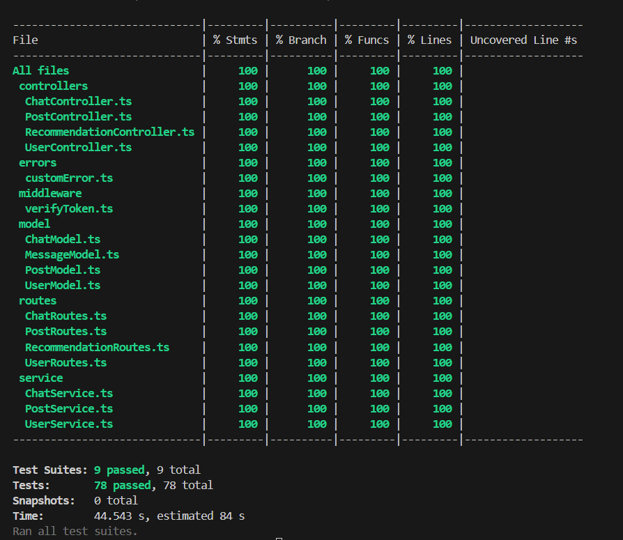
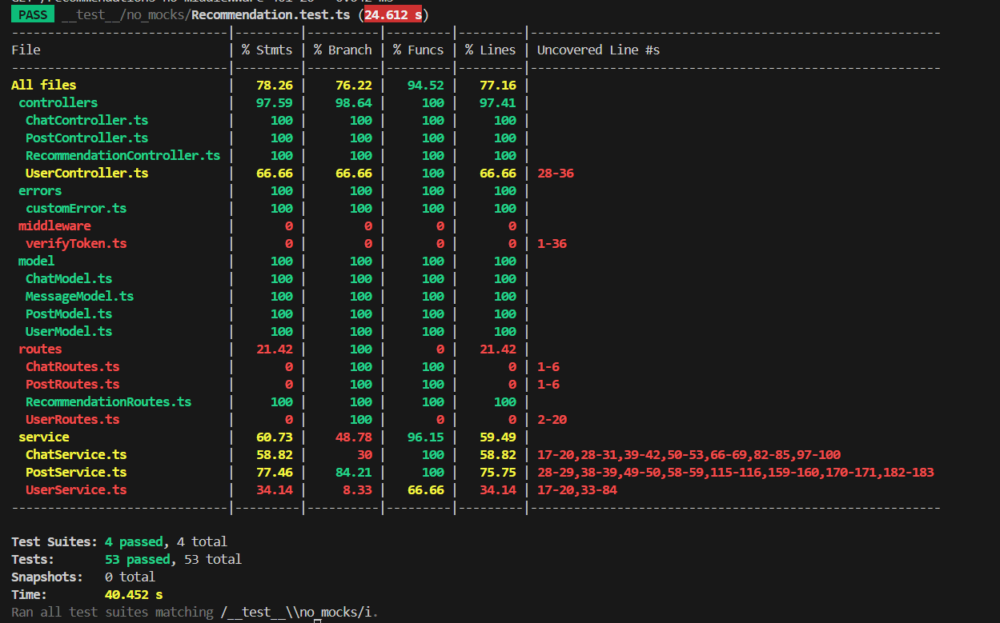
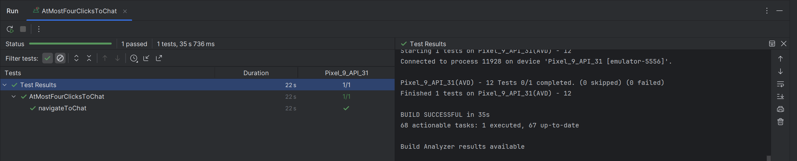
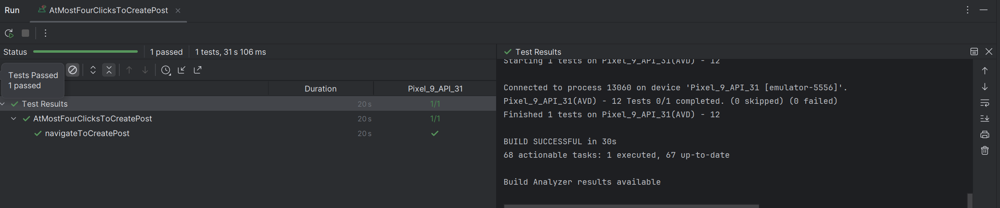
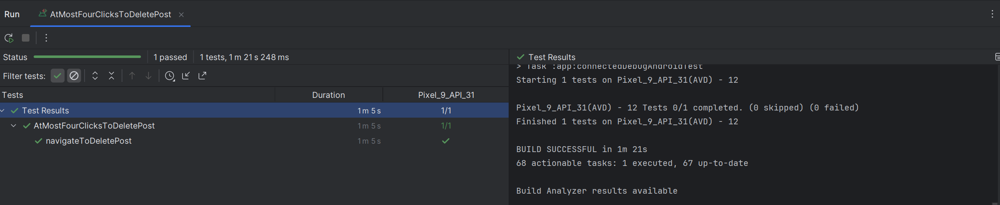
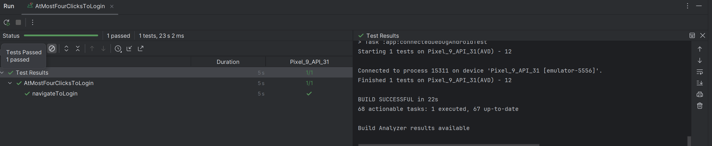
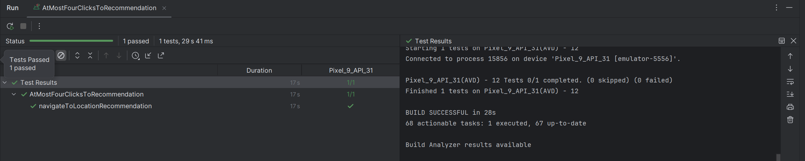
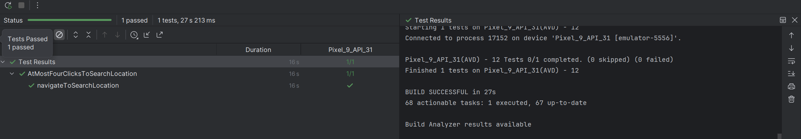
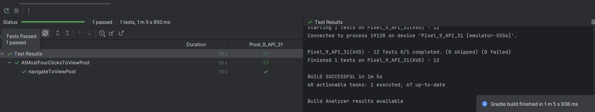
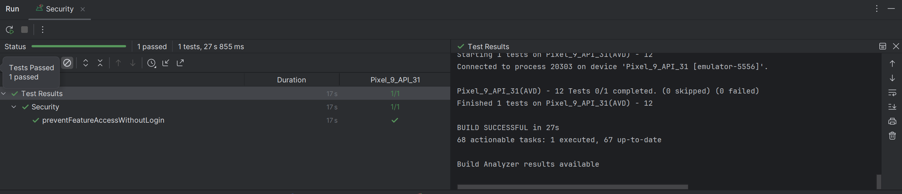

# Example M5: Testing and Code Review

## 1. Change History

| **Change Date**   | **Modified Sections** | **Rationale** |
| ----------------- | --------------------- | ------------- |
| 3/14/2025         | Non Functional Requirements: Added security requirement where some features (upload, view profile, chat) are blocked if they are not signed in.  |  Our app allows some features for non-signed in user, such as viewing public post, searching location. However, some features require user to be registered because it requires user's credential (such as posting and chats), hence these features should be blocked. 
  

---

## 2. Back-end Test Specification: APIs

### 2.1. Locations of Back-end Tests and Instructions to Run Them

#### 2.1.1. Tests

| **Interface**                 | **Describe Group Location, No Mocks**                | **Describe Group Location, With Mocks**            | **Mocked Components**              |
| ----------------------------- | ---------------------------------------------------- | -------------------------------------------------- | ---------------------------------- |
| **GET /chats**          | [`backend/__test__/no_mocks/Chat.test.ts#L236`](#) | [`backend/__test__/mocks/ChatMocks.test.ts#L133`](#) | Chat |
| **GET /chats/:id** | [`backend/__test__/no_mocks/Chat.test.ts#L518`](#) | [`backend/__test__/mocks/ChatMocks.test.ts#L171`](#) | Chat                   |
| **POST /chats**                           | [`backend/__test__/no_mocks/Chat.test.ts#L158`](#) | [`backend/__test__/mocks/ChatMocks.test.ts#L112`](#) | Chat, jwt.verify                                |
| **POST /chat/:id**                           | [`backend/__test__/no_mocks/Chat.test.ts#L325`](#) | [`backend/__test__/mocks/ChatMocks.test.ts#L80`](#) | Chat, jwt.verify                                |
| **DELETE /chats/:id**          | [`backend/__test__/no_mocks/Chat.test.ts#L615`](#) | [`backend/__test__/mocks/ChatMocks.test.ts#L197`](#) | Chat, jwt.verify |
| **DELETE /chat/:id/messages/:message_id** | [`backend/__test__/no_mocks/Chat.test.ts#L422`](#) | [`backend/__test__/mocks/ChatMocks.test.ts#L223`](#) | Chat, jwt.verify                     |
| **GET /posts**                           | [`backend/__test__/no_mocks/Post.test.ts#L425`](#) | [`backend/__test__/mocks/PostMock.test.ts#L340`](#)  | Post                               |
| **GET /posts-authenticated**                | [`backend/__test__/no_mocks/Post.test.ts#L192`](#) | [`backend/__test__/mocks/PostMock.test.ts#L131`](#) |  Post, jwt.verify, PostService.getPosts                              |
| **GET /posts/:id**                  | [`backend/__test__/no_mocks/Post.test.ts#L166`](#) | [`backend/__test__/mocks/PostMock.test.ts#L101`](#)  | Post                              |
| **PUT /posts/:id**                   | [`backend/__test__/no_mocks/Post.test.ts#L552`](#) | [`backend/__test__/mocks/PostMock.test.ts#L392`](#)  | Post, jwt.verify                                |
| **POST /posts**                 | [`backend/__test__/no_mocks/Post.test.ts#L124`](#) | [`backend/__test__/mocks/PostMock.test.ts#L75`](#)   | Post, jwt.verify                                |
| **DELETE /posts/:id**                 | [`backend/__test__/no_mocks/Post.test.ts#L748`](#) | [`backend/__test__/mocks/PostMock.test.ts#L426`](#)   | Post, jwt.verify                                |
| **GET /recommendations**                 | [`backend/__test__/no_mocks/Recommendation.test.ts#L121`](#) | N/A |Recommendation System                            |
| **GET /user/:id**                 | [`backend/__test__/no_mocks/User.test.ts#L46`](#) | [`backend/__test__/mocks/UserMock.test.ts#L168`](#) | User DB                             |
| **POST /user/auth**                 | [`backend/__test__/no_mocks/User.test.ts#L81`](#) | [`backend/__test__/mocks/UserMock.test.ts#L81`](#) & [`backend/__test__/mocks/NoPayloadUser.test.ts#L57`](#)| User                          |

#### 2.1.2. Commit Hash Where Tests Run

`88b37f15cb88c7fc934fb6c80fb607555e8088a0`

#### 2.1.3. Explanation on How to Run the Tests

1. **Clone the Repository**:

   - Open your terminal and run:
     ```
     git clone https://github.com/xuantungbrian/Tomato.git
     ```

2. **Switch branches and navigate to backend folder**:
   - Switch to the dev branch by running:
     ```
     git checkout dev
     ```
   - Go to the backend folder:
     ```
     cd backend
     ```

3. **Run the tests**
   - Run the test as so:
     ```
     npx jest --coverage
     ```
     to show the full coverage

### 2.2. GitHub Actions Configuration Location

`~/.github/workflows/backend-tests.yml`

### 2.3. Jest Coverage Report Screenshots With Mocks



### 2.4. Jest Coverage Report Screenshots Without Mocks



---

## 3. Back-end Test Specification: Tests of Non-Functional Requirements

### 3.1. Test Locations in Git

| **Non-Functional Requirement**  | **Location in Git**                              |
| ------------------------------- | ------------------------------------------------ |
| **Usability (No more than 4 clicks to any feature)** | [`frontEnd/app/src/androidTest/java/com/example/tomato/AtMostFourClicksToChat.kt`](../frontEnd/app/src/androidTest/java/com/example/tomato/AtMostFourClicksToChat.kt),  [`frontEnd/app/src/androidTest/java/com/example/tomato/AtMostFourClicksToCreatePost.kt`](../frontEnd/app/src/androidTest/java/com/example/tomato/AtMostFourClicksToCreatePost.kt),  [`frontEnd/app/src/androidTest/java/com/example/tomato/AtMostFourClicksToDeletePost.kt`](../frontEnd/app/src/androidTest/java/com/example/tomato/AtMostFourClicksToDeletePost.kt),  [`frontEnd/app/src/androidTest/java/com/example/tomato/AtMostFourClicksToLogin.kt`](../frontEnd/app/src/androidTest/java/com/example/tomato/AtMostFourClicksToLogin.kt),  [`frontEnd/app/src/androidTest/java/com/example/tomato/AtMostFourClicksToRecommendation.kt`](../frontEnd/app/src/androidTest/java/com/example/tomato/AtMostFourClicksToRecommendation.kt),  [`frontEnd/app/src/androidTest/java/com/example/tomato/AtMostFourClicksToSearchLocation.kt`](../frontEnd/app/src/androidTest/java/com/example/tomato/AtMostFourClicksToSearchLocation.kt),  [`frontEnd/app/src/androidTest/java/com/example/tomato/AtMostFourClicksToViewPost.kt`](../frontEnd/app/src/androidTest/java/com/example/tomato/AtMostFourClicksToViewPost.kt)
| **Feature Security (No access to some feature if not login)**          | [`frontEnd/app/src/androidTest/java/com/example/tomato/Security.kt`](../frontEnd/app/src/androidTest/java/com/example/tomato/Security.kt) |

### 3.2. Test Verification and Logs

- **Usability (No more than 4 clicks to any feature)**

  - **Verification:** These tests simulates user navigating to their target feature from start, including login and granting location permission. They will count the user step from start until the user see the feature on screen. At the end of the test, the step count will be checked to be less or equal to 4.
  - **Log Output**
    
    
    
    

    

    

    

    

    
    

- **Feature Security (No access to some feature if not login)**
  - **Verification:** The test simulates a user try to access feature upload, delete post, view profile, open chat without login. From the app start, it will click on the button leading to this feature and check that it cannot use them while also checking if it receives alerts warning that this feature requires login.
  - **Log Output**
    

---

## 4. Front-end Test Specification

### 4.1. Location in Git of Front-end Test Suite:

`frontEnd/app/src/androidTest/java/com/example/tomato/`

### 4.2. Tests

- **Use Case: Login**

  - **Expected Behaviors:**
    | **Scenario Steps** | **Test Case Steps** |
    | ------------------ | ------------------- |
    | 1. User opens the app | Launch map activity |
    | 2. User click on "Sign in" button | Check if there is a "Sign in" button and click on it |
    | 3. Google login window pops up | Check if Google login window pops up |
    | 4a. User cancel the login by clicking outside of the login box/press back button | Click outside of the Google login pop up|
    | 4a1. An alert appears telling the user they were unable to login, along with the reason why | Check an alert appear with the reason why the user cannot log in| 
    | 4a2. User click on "OKAY" to turn off the alert | Check there is an OKAY button on the alert and click on it, then check the sign in button still display and cannot use profile feature |
    | 4. User input their credentials and follow Google instructions | Input credentials of a fake Google account and follow instructions |
    | 5. User goes back to map page with the sign in button replaced by their Google account logo | Check the map is displayed, the sign in button is not displayed and able to use the profile feature |

  - **Test Logs:**
    ```
    2025-03-17 08:48:22: Launching userLogin() on 'Pixel 9 API 31.
    Running tests
    Executing tasks: [:app:connectedDebugAndroidTest] in project C:\Users\xuant\Files\Study\UBC_study_materials\UBC_Fifth_Year-Winter_Term\Semester_2\CPEN 321\Tomato\frontEnd


    > Configure project :app
    AGPBI: {"kind":"warning","text":"The option setting 'android.experimental.testOptions.emulatorSnapshots.maxSnapshotsForTestFailures=0' is experimental.","sources":[{}]}

    > Task :app:checkKotlinGradlePluginConfigurationErrors SKIPPED
    > Task :app:preBuild UP-TO-DATE
    > Task :app:preDebugBuild UP-TO-DATE
    > Task :app:dataBindingMergeDependencyArtifactsDebug UP-TO-DATE
    > Task :app:generateDebugResValues UP-TO-DATE
    > Task :app:generateDebugResources UP-TO-DATE
    > Task :app:processDebugGoogleServices UP-TO-DATE
    > Task :app:mergeDebugResources UP-TO-DATE
    > Task :app:packageDebugResources UP-TO-DATE
    > Task :app:parseDebugLocalResources UP-TO-DATE
    > Task :app:dataBindingGenBaseClassesDebug UP-TO-DATE
    > Task :app:generateDebugBuildConfig UP-TO-DATE
    > Task :app:checkDebugAarMetadata UP-TO-DATE
    > Task :app:mapDebugSourceSetPaths UP-TO-DATE
    > Task :app:createDebugCompatibleScreenManifests UP-TO-DATE
    > Task :app:extractDeepLinksDebug UP-TO-DATE
    > Task :app:processDebugMainManifest UP-TO-DATE
    > Task :app:processDebugManifest UP-TO-DATE
    > Task :app:processDebugManifestForPackage UP-TO-DATE
    > Task :app:processDebugResources UP-TO-DATE
    > Task :app:compileDebugKotlin UP-TO-DATE
    > Task :app:javaPreCompileDebug UP-TO-DATE
    > Task :app:compileDebugJavaWithJavac UP-TO-DATE
    > Task :app:bundleDebugClassesToCompileJar UP-TO-DATE
    > Task :app:preDebugAndroidTestBuild SKIPPED
    > Task :app:dataBindingMergeDependencyArtifactsDebugAndroidTest UP-TO-DATE
    > Task :app:generateDebugAndroidTestResValues UP-TO-DATE
    > Task :app:generateDebugAndroidTestResources UP-TO-DATE
    > Task :app:mergeDebugAndroidTestResources UP-TO-DATE
    > Task :app:dataBindingGenBaseClassesDebugAndroidTest UP-TO-DATE
    > Task :app:processDebugAndroidTestManifest UP-TO-DATE
    > Task :app:generateDebugAndroidTestBuildConfig UP-TO-DATE
    > Task :app:checkDebugAndroidTestAarMetadata UP-TO-DATE
    > Task :app:mapDebugAndroidTestSourceSetPaths UP-TO-DATE
    > Task :app:processDebugAndroidTestResources UP-TO-DATE
    > Task :app:javaPreCompileDebugAndroidTest UP-TO-DATE
    > Task :app:mergeDebugShaders UP-TO-DATE
    > Task :app:compileDebugShaders NO-SOURCE
    > Task :app:generateDebugAssets UP-TO-DATE
    > Task :app:mergeDebugAssets UP-TO-DATE
    > Task :app:compressDebugAssets UP-TO-DATE
    > Task :app:processDebugJavaRes UP-TO-DATE
    > Task :app:mergeDebugJavaResource UP-TO-DATE
    > Task :app:checkDebugDuplicateClasses UP-TO-DATE
    > Task :app:desugarDebugFileDependencies UP-TO-DATE
    > Task :app:mergeExtDexDebug UP-TO-DATE
    > Task :app:mergeLibDexDebug UP-TO-DATE
    > Task :app:dexBuilderDebug UP-TO-DATE
    > Task :app:mergeProjectDexDebug UP-TO-DATE
    > Task :app:mergeDebugJniLibFolders UP-TO-DATE
    > Task :app:mergeDebugNativeLibs NO-SOURCE
    > Task :app:stripDebugDebugSymbols NO-SOURCE
    > Task :app:validateSigningDebug UP-TO-DATE
    > Task :app:writeDebugAppMetadata UP-TO-DATE
    > Task :app:writeDebugSigningConfigVersions UP-TO-DATE
    > Task :app:packageDebug UP-TO-DATE
    > Task :app:createDebugApkListingFileRedirect UP-TO-DATE
    > Task :app:mergeDebugAndroidTestShaders UP-TO-DATE
    > Task :app:compileDebugAndroidTestShaders NO-SOURCE
    > Task :app:generateDebugAndroidTestAssets UP-TO-DATE
    > Task :app:mergeDebugAndroidTestAssets UP-TO-DATE
    > Task :app:compressDebugAndroidTestAssets UP-TO-DATE
    > Task :app:checkDebugAndroidTestDuplicateClasses UP-TO-DATE
    > Task :app:desugarDebugAndroidTestFileDependencies UP-TO-DATE
    > Task :app:mergeExtDexDebugAndroidTest UP-TO-DATE
    > Task :app:mergeLibDexDebugAndroidTest UP-TO-DATE
    > Task :app:mergeDebugAndroidTestJniLibFolders UP-TO-DATE
    > Task :app:mergeDebugAndroidTestNativeLibs NO-SOURCE
    > Task :app:stripDebugAndroidTestDebugSymbols NO-SOURCE
    > Task :app:validateSigningDebugAndroidTest UP-TO-DATE
    > Task :app:writeDebugAndroidTestSigningConfigVersions UP-TO-DATE
    > Task :app:compileDebugAndroidTestKotlin
    > Task :app:compileDebugAndroidTestJavaWithJavac UP-TO-DATE
    > Task :app:processDebugAndroidTestJavaRes UP-TO-DATE
    > Task :app:mergeDebugAndroidTestJavaResource UP-TO-DATE
    > Task :app:dexBuilderDebugAndroidTest
    > Task :app:mergeProjectDexDebugAndroidTest
    > Task :app:packageDebugAndroidTest
    > Task :app:createDebugAndroidTestApkListingFileRedirect UP-TO-DATE
    Connected to process 3373 on device 'Pixel_9_API_31 [emulator-5554]'.

    > Task :app:connectedDebugAndroidTest
    Starting 1 tests on Pixel_9_API_31(AVD) - 12

    Pixel_9_API_31(AVD) - 12 Tests 0/1 completed. (0 skipped) (0 failed)
    Finished 1 tests on Pixel_9_API_31(AVD) - 12

    BUILD SUCCESSFUL in 1m 22s
    68 actionable tasks: 5 executed, 63 up-to-date

    Build Analyzer results available
    ```

- **Use Case: Search location**

  - **Expected Behaviors:**
    | **Scenario Steps** | **Test Case Steps** |
    | ------------------ | ------------------- |
    | 1. User goes to the search bar at the top of the screen | Click on the search bar at top left of the screen |
    | 2. User inputs the location they want to see | Input string "metrot" and click on the autocomplete string "Metrotown, Burnaby, BC, Canada" |
    | 3. User clicks on Enter in the keyboard | Click on enter |
    | 4. App move camera to the input location | Check current camera position equal to latitude and longtitude of the input location|

  - **Test Logs:**
    ```
    2025-03-17 09:05:46: Launching SearchLocations on 'Pixel 9 API 31.
    Running tests
    Executing tasks: [:app:connectedDebugAndroidTest] in project C:\Users\xuant\Files\Study\UBC_study_materials\UBC_Fifth_Year-Winter_Term\Semester_2\CPEN 321\Tomato\frontEnd


    > Configure project :app
    AGPBI: {"kind":"warning","text":"The option setting 'android.experimental.testOptions.emulatorSnapshots.maxSnapshotsForTestFailures=0' is experimental.","sources":[{}]}

    > Task :app:checkKotlinGradlePluginConfigurationErrors SKIPPED
    > Task :app:preBuild UP-TO-DATE
    > Task :app:preDebugBuild UP-TO-DATE
    > Task :app:dataBindingMergeDependencyArtifactsDebug UP-TO-DATE
    > Task :app:generateDebugResValues UP-TO-DATE
    > Task :app:generateDebugResources UP-TO-DATE
    > Task :app:processDebugGoogleServices UP-TO-DATE
    > Task :app:mergeDebugResources UP-TO-DATE
    > Task :app:packageDebugResources UP-TO-DATE
    > Task :app:parseDebugLocalResources UP-TO-DATE
    > Task :app:dataBindingGenBaseClassesDebug UP-TO-DATE
    > Task :app:generateDebugBuildConfig UP-TO-DATE
    > Task :app:checkDebugAarMetadata UP-TO-DATE
    > Task :app:mapDebugSourceSetPaths UP-TO-DATE
    > Task :app:createDebugCompatibleScreenManifests UP-TO-DATE
    > Task :app:extractDeepLinksDebug UP-TO-DATE
    > Task :app:processDebugMainManifest UP-TO-DATE
    > Task :app:processDebugManifest UP-TO-DATE
    > Task :app:processDebugManifestForPackage UP-TO-DATE
    > Task :app:processDebugResources UP-TO-DATE
    > Task :app:compileDebugKotlin UP-TO-DATE
    > Task :app:javaPreCompileDebug UP-TO-DATE
    > Task :app:compileDebugJavaWithJavac UP-TO-DATE
    > Task :app:bundleDebugClassesToCompileJar UP-TO-DATE
    > Task :app:preDebugAndroidTestBuild SKIPPED
    > Task :app:dataBindingMergeDependencyArtifactsDebugAndroidTest UP-TO-DATE
    > Task :app:generateDebugAndroidTestResValues UP-TO-DATE
    > Task :app:generateDebugAndroidTestResources UP-TO-DATE
    > Task :app:mergeDebugAndroidTestResources UP-TO-DATE
    > Task :app:dataBindingGenBaseClassesDebugAndroidTest UP-TO-DATE
    > Task :app:processDebugAndroidTestManifest UP-TO-DATE
    > Task :app:generateDebugAndroidTestBuildConfig UP-TO-DATE
    > Task :app:checkDebugAndroidTestAarMetadata UP-TO-DATE
    > Task :app:mapDebugAndroidTestSourceSetPaths UP-TO-DATE
    > Task :app:processDebugAndroidTestResources UP-TO-DATE
    > Task :app:javaPreCompileDebugAndroidTest UP-TO-DATE
    > Task :app:mergeDebugShaders UP-TO-DATE
    > Task :app:compileDebugShaders NO-SOURCE
    > Task :app:generateDebugAssets UP-TO-DATE
    > Task :app:mergeDebugAssets UP-TO-DATE
    > Task :app:compressDebugAssets UP-TO-DATE
    > Task :app:processDebugJavaRes UP-TO-DATE
    > Task :app:mergeDebugJavaResource UP-TO-DATE
    > Task :app:checkDebugDuplicateClasses UP-TO-DATE
    > Task :app:desugarDebugFileDependencies UP-TO-DATE
    > Task :app:mergeExtDexDebug UP-TO-DATE
    > Task :app:mergeLibDexDebug UP-TO-DATE
    > Task :app:dexBuilderDebug UP-TO-DATE
    > Task :app:mergeProjectDexDebug UP-TO-DATE
    > Task :app:mergeDebugJniLibFolders UP-TO-DATE
    > Task :app:mergeDebugNativeLibs NO-SOURCE
    > Task :app:stripDebugDebugSymbols NO-SOURCE
    > Task :app:validateSigningDebug UP-TO-DATE
    > Task :app:writeDebugAppMetadata UP-TO-DATE
    > Task :app:writeDebugSigningConfigVersions UP-TO-DATE
    > Task :app:packageDebug UP-TO-DATE
    > Task :app:createDebugApkListingFileRedirect UP-TO-DATE
    > Task :app:mergeDebugAndroidTestShaders UP-TO-DATE
    > Task :app:compileDebugAndroidTestShaders NO-SOURCE
    > Task :app:generateDebugAndroidTestAssets UP-TO-DATE
    > Task :app:mergeDebugAndroidTestAssets UP-TO-DATE
    > Task :app:compressDebugAndroidTestAssets UP-TO-DATE
    > Task :app:checkDebugAndroidTestDuplicateClasses UP-TO-DATE
    > Task :app:desugarDebugAndroidTestFileDependencies UP-TO-DATE
    > Task :app:mergeExtDexDebugAndroidTest UP-TO-DATE
    > Task :app:mergeLibDexDebugAndroidTest UP-TO-DATE
    > Task :app:mergeDebugAndroidTestJniLibFolders UP-TO-DATE
    > Task :app:mergeDebugAndroidTestNativeLibs NO-SOURCE
    > Task :app:stripDebugAndroidTestDebugSymbols NO-SOURCE
    > Task :app:validateSigningDebugAndroidTest UP-TO-DATE
    > Task :app:writeDebugAndroidTestSigningConfigVersions UP-TO-DATE
    > Task :app:compileDebugAndroidTestKotlin
    > Task :app:compileDebugAndroidTestJavaWithJavac UP-TO-DATE
    > Task :app:processDebugAndroidTestJavaRes UP-TO-DATE
    > Task :app:mergeDebugAndroidTestJavaResource UP-TO-DATE
    > Task :app:dexBuilderDebugAndroidTest
    > Task :app:mergeProjectDexDebugAndroidTest
    > Task :app:packageDebugAndroidTest
    > Task :app:createDebugAndroidTestApkListingFileRedirect UP-TO-DATE

    > Task :app:connectedDebugAndroidTest
    Starting 1 tests on Pixel_9_API_31(AVD) - 12
    Connected to process 5689 on device 'Pixel_9_API_31 [emulator-5554]'.

    Pixel_9_API_31(AVD) - 12 Tests 0/1 completed. (0 skipped) (0 failed)
    Finished 1 tests on Pixel_9_API_31(AVD) - 12

    BUILD SUCCESSFUL in 1m 18s
    68 actionable tasks: 5 executed, 63 up-to-date

    Build Analyzer results available
    ```

- **Use Case: Display Map**  
    Because the use case has 2 independent success scenario and one failure scenario that cannot follow the independent success scenario
    - **Shows the map at the user’s general location**
      - **Expected Behaviors for success scenario:**
        | **Scenario Steps** | **Test Case Steps** |
        | ------------------ | ------------------- |
        | 1. User allows the app to access their location | Click on "Only this time" when asked for location permission |
        | 2. App successfully connects to Google Maps API | Check map is displayed |
        | 3. App opens the map to the user’s general location | Get user location and check the map camera location to be equal to user location |

      - **Test Logs:**
        ```
        2025-03-17 12:09:47: Launching DisplayMapOnOpen on 'Pixel 9 API 31.
        Running tests
        Executing tasks: [:app:connectedDebugAndroidTest] in project C:\Users\xuant\Files\Study\UBC_study_materials\UBC_Fifth_Year-Winter_Term\Semester_2\CPEN 321\Tomato\frontEnd


        > Configure project :app
        AGPBI: {"kind":"warning","text":"The option setting 'android.experimental.testOptions.emulatorSnapshots.maxSnapshotsForTestFailures=0' is experimental.","sources":[{}]}

        > Task :app:checkKotlinGradlePluginConfigurationErrors SKIPPED
        > Task :app:preBuild UP-TO-DATE
        > Task :app:preDebugBuild UP-TO-DATE
        > Task :app:dataBindingMergeDependencyArtifactsDebug UP-TO-DATE
        > Task :app:generateDebugResValues UP-TO-DATE
        > Task :app:generateDebugResources UP-TO-DATE
        > Task :app:processDebugGoogleServices UP-TO-DATE
        > Task :app:mergeDebugResources UP-TO-DATE
        > Task :app:packageDebugResources UP-TO-DATE
        > Task :app:parseDebugLocalResources UP-TO-DATE
        > Task :app:dataBindingGenBaseClassesDebug UP-TO-DATE
        > Task :app:generateDebugBuildConfig UP-TO-DATE
        > Task :app:checkDebugAarMetadata UP-TO-DATE
        > Task :app:mapDebugSourceSetPaths UP-TO-DATE
        > Task :app:createDebugCompatibleScreenManifests UP-TO-DATE
        > Task :app:extractDeepLinksDebug UP-TO-DATE
        > Task :app:processDebugMainManifest UP-TO-DATE
        > Task :app:processDebugManifest UP-TO-DATE
        > Task :app:processDebugManifestForPackage UP-TO-DATE
        > Task :app:processDebugResources UP-TO-DATE
        > Task :app:compileDebugKotlin UP-TO-DATE
        > Task :app:javaPreCompileDebug UP-TO-DATE
        > Task :app:compileDebugJavaWithJavac UP-TO-DATE
        > Task :app:bundleDebugClassesToCompileJar UP-TO-DATE
        > Task :app:preDebugAndroidTestBuild SKIPPED
        > Task :app:dataBindingMergeDependencyArtifactsDebugAndroidTest UP-TO-DATE
        > Task :app:generateDebugAndroidTestResValues UP-TO-DATE
        > Task :app:generateDebugAndroidTestResources UP-TO-DATE
        > Task :app:mergeDebugAndroidTestResources UP-TO-DATE
        > Task :app:dataBindingGenBaseClassesDebugAndroidTest UP-TO-DATE
        > Task :app:processDebugAndroidTestManifest UP-TO-DATE
        > Task :app:generateDebugAndroidTestBuildConfig UP-TO-DATE
        > Task :app:checkDebugAndroidTestAarMetadata UP-TO-DATE
        > Task :app:mapDebugAndroidTestSourceSetPaths UP-TO-DATE
        > Task :app:processDebugAndroidTestResources UP-TO-DATE
        > Task :app:compileDebugAndroidTestKotlin UP-TO-DATE
        > Task :app:javaPreCompileDebugAndroidTest UP-TO-DATE
        > Task :app:compileDebugAndroidTestJavaWithJavac UP-TO-DATE
        > Task :app:mergeDebugShaders UP-TO-DATE
        > Task :app:compileDebugShaders NO-SOURCE
        > Task :app:generateDebugAssets UP-TO-DATE
        > Task :app:mergeDebugAssets UP-TO-DATE
        > Task :app:compressDebugAssets UP-TO-DATE
        > Task :app:processDebugJavaRes UP-TO-DATE
        > Task :app:mergeDebugJavaResource UP-TO-DATE
        > Task :app:checkDebugDuplicateClasses UP-TO-DATE
        > Task :app:desugarDebugFileDependencies UP-TO-DATE
        > Task :app:mergeExtDexDebug UP-TO-DATE
        > Task :app:mergeLibDexDebug UP-TO-DATE
        > Task :app:dexBuilderDebug UP-TO-DATE
        > Task :app:mergeProjectDexDebug UP-TO-DATE
        > Task :app:mergeDebugJniLibFolders UP-TO-DATE
        > Task :app:mergeDebugNativeLibs NO-SOURCE
        > Task :app:stripDebugDebugSymbols NO-SOURCE
        > Task :app:validateSigningDebug UP-TO-DATE
        > Task :app:writeDebugAppMetadata UP-TO-DATE
        > Task :app:writeDebugSigningConfigVersions UP-TO-DATE
        > Task :app:packageDebug UP-TO-DATE
        > Task :app:createDebugApkListingFileRedirect UP-TO-DATE
        > Task :app:mergeDebugAndroidTestShaders UP-TO-DATE
        > Task :app:compileDebugAndroidTestShaders NO-SOURCE
        > Task :app:generateDebugAndroidTestAssets UP-TO-DATE
        > Task :app:mergeDebugAndroidTestAssets UP-TO-DATE
        > Task :app:compressDebugAndroidTestAssets UP-TO-DATE
        > Task :app:processDebugAndroidTestJavaRes UP-TO-DATE
        > Task :app:mergeDebugAndroidTestJavaResource UP-TO-DATE
        > Task :app:checkDebugAndroidTestDuplicateClasses UP-TO-DATE
        > Task :app:desugarDebugAndroidTestFileDependencies UP-TO-DATE
        > Task :app:mergeExtDexDebugAndroidTest UP-TO-DATE
        > Task :app:mergeLibDexDebugAndroidTest UP-TO-DATE
        > Task :app:dexBuilderDebugAndroidTest UP-TO-DATE
        > Task :app:mergeProjectDexDebugAndroidTest UP-TO-DATE
        > Task :app:mergeDebugAndroidTestJniLibFolders UP-TO-DATE
        > Task :app:mergeDebugAndroidTestNativeLibs NO-SOURCE
        > Task :app:stripDebugAndroidTestDebugSymbols NO-SOURCE
        > Task :app:validateSigningDebugAndroidTest UP-TO-DATE
        > Task :app:writeDebugAndroidTestSigningConfigVersions UP-TO-DATE
        > Task :app:packageDebugAndroidTest UP-TO-DATE
        > Task :app:createDebugAndroidTestApkListingFileRedirect UP-TO-DATE
        Connected to process 10344 on device 'Pixel_9_API_31 [emulator-5556]'.

        > Task :app:connectedDebugAndroidTest
        Starting 1 tests on Pixel_9_API_31(AVD) - 12

        Pixel_9_API_31(AVD) - 12 Tests 0/1 completed. (0 skipped) (0 failed)
        Finished 1 tests on Pixel_9_API_31(AVD) - 12

        BUILD SUCCESSFUL in 22s
        68 actionable tasks: 1 executed, 67 up-to-date

        Build Analyzer results available
        ```
      - **Expected Behaviors for failure scenario:**
        | **Scenario Steps** | **Test Case Steps** |
        | ------------------ | ------------------- |
        | 1. User denied the app to access their location | Click on "Don't allow" when asked for location permission |
        | 2. App successfully connects to Google Maps API | Verify the map is displayed|
        | 3. App opens the map to location with latitude, longtitude 0, 0| Verify the camera position is set to (0, 0) |

      - **Test Logs:**
        ```
        2025-03-17 12:11:09: Launching DisplayMapWithUserRejectLocationPermission on 'Pixel 9 API 31.
        Running tests
        Executing tasks: [:app:connectedDebugAndroidTest] in project C:\Users\xuant\Files\Study\UBC_study_materials\UBC_Fifth_Year-Winter_Term\Semester_2\CPEN 321\Tomato\frontEnd


        > Configure project :app
        AGPBI: {"kind":"warning","text":"The option setting 'android.experimental.testOptions.emulatorSnapshots.maxSnapshotsForTestFailures=0' is experimental.","sources":[{}]}

        > Task :app:checkKotlinGradlePluginConfigurationErrors SKIPPED
        > Task :app:preBuild UP-TO-DATE
        > Task :app:preDebugBuild UP-TO-DATE
        > Task :app:dataBindingMergeDependencyArtifactsDebug UP-TO-DATE
        > Task :app:generateDebugResValues UP-TO-DATE
        > Task :app:generateDebugResources UP-TO-DATE
        > Task :app:processDebugGoogleServices UP-TO-DATE
        > Task :app:mergeDebugResources UP-TO-DATE
        > Task :app:packageDebugResources UP-TO-DATE
        > Task :app:parseDebugLocalResources UP-TO-DATE
        > Task :app:dataBindingGenBaseClassesDebug UP-TO-DATE
        > Task :app:generateDebugBuildConfig UP-TO-DATE
        > Task :app:checkDebugAarMetadata UP-TO-DATE
        > Task :app:mapDebugSourceSetPaths UP-TO-DATE
        > Task :app:createDebugCompatibleScreenManifests UP-TO-DATE
        > Task :app:extractDeepLinksDebug UP-TO-DATE
        > Task :app:processDebugMainManifest UP-TO-DATE
        > Task :app:processDebugManifest UP-TO-DATE
        > Task :app:processDebugManifestForPackage UP-TO-DATE
        > Task :app:processDebugResources UP-TO-DATE
        > Task :app:compileDebugKotlin UP-TO-DATE
        > Task :app:javaPreCompileDebug UP-TO-DATE
        > Task :app:compileDebugJavaWithJavac UP-TO-DATE
        > Task :app:bundleDebugClassesToCompileJar UP-TO-DATE
        > Task :app:preDebugAndroidTestBuild SKIPPED
        > Task :app:dataBindingMergeDependencyArtifactsDebugAndroidTest UP-TO-DATE
        > Task :app:generateDebugAndroidTestResValues UP-TO-DATE
        > Task :app:generateDebugAndroidTestResources UP-TO-DATE
        > Task :app:mergeDebugAndroidTestResources UP-TO-DATE
        > Task :app:dataBindingGenBaseClassesDebugAndroidTest UP-TO-DATE
        > Task :app:processDebugAndroidTestManifest UP-TO-DATE
        > Task :app:generateDebugAndroidTestBuildConfig UP-TO-DATE
        > Task :app:checkDebugAndroidTestAarMetadata UP-TO-DATE
        > Task :app:mapDebugAndroidTestSourceSetPaths UP-TO-DATE
        > Task :app:processDebugAndroidTestResources UP-TO-DATE
        > Task :app:compileDebugAndroidTestKotlin UP-TO-DATE
        > Task :app:javaPreCompileDebugAndroidTest UP-TO-DATE
        > Task :app:compileDebugAndroidTestJavaWithJavac UP-TO-DATE
        > Task :app:mergeDebugShaders UP-TO-DATE
        > Task :app:compileDebugShaders NO-SOURCE
        > Task :app:generateDebugAssets UP-TO-DATE
        > Task :app:mergeDebugAssets UP-TO-DATE
        > Task :app:compressDebugAssets UP-TO-DATE
        > Task :app:processDebugJavaRes UP-TO-DATE
        > Task :app:mergeDebugJavaResource UP-TO-DATE
        > Task :app:checkDebugDuplicateClasses UP-TO-DATE
        > Task :app:desugarDebugFileDependencies UP-TO-DATE
        > Task :app:mergeExtDexDebug UP-TO-DATE
        > Task :app:mergeLibDexDebug UP-TO-DATE
        > Task :app:dexBuilderDebug UP-TO-DATE
        > Task :app:mergeProjectDexDebug UP-TO-DATE
        > Task :app:mergeDebugJniLibFolders UP-TO-DATE
        > Task :app:mergeDebugNativeLibs NO-SOURCE
        > Task :app:stripDebugDebugSymbols NO-SOURCE
        > Task :app:validateSigningDebug UP-TO-DATE
        > Task :app:writeDebugAppMetadata UP-TO-DATE
        > Task :app:writeDebugSigningConfigVersions UP-TO-DATE
        > Task :app:packageDebug UP-TO-DATE
        > Task :app:createDebugApkListingFileRedirect UP-TO-DATE
        > Task :app:mergeDebugAndroidTestShaders UP-TO-DATE
        > Task :app:compileDebugAndroidTestShaders NO-SOURCE
        > Task :app:generateDebugAndroidTestAssets UP-TO-DATE
        > Task :app:mergeDebugAndroidTestAssets UP-TO-DATE
        > Task :app:compressDebugAndroidTestAssets UP-TO-DATE
        > Task :app:processDebugAndroidTestJavaRes UP-TO-DATE
        > Task :app:mergeDebugAndroidTestJavaResource UP-TO-DATE
        > Task :app:checkDebugAndroidTestDuplicateClasses UP-TO-DATE
        > Task :app:desugarDebugAndroidTestFileDependencies UP-TO-DATE
        > Task :app:mergeExtDexDebugAndroidTest UP-TO-DATE
        > Task :app:mergeLibDexDebugAndroidTest UP-TO-DATE
        > Task :app:dexBuilderDebugAndroidTest UP-TO-DATE
        > Task :app:mergeProjectDexDebugAndroidTest UP-TO-DATE
        > Task :app:mergeDebugAndroidTestJniLibFolders UP-TO-DATE
        > Task :app:mergeDebugAndroidTestNativeLibs NO-SOURCE
        > Task :app:stripDebugAndroidTestDebugSymbols NO-SOURCE
        > Task :app:validateSigningDebugAndroidTest UP-TO-DATE
        > Task :app:writeDebugAndroidTestSigningConfigVersions UP-TO-DATE
        > Task :app:packageDebugAndroidTest UP-TO-DATE
        > Task :app:createDebugAndroidTestApkListingFileRedirect UP-TO-DATE

        > Task :app:connectedDebugAndroidTest
        Starting 1 tests on Pixel_9_API_31(AVD) - 12
        Connected to process 10816 on device 'Pixel_9_API_31 [emulator-5556]'.

        Pixel_9_API_31(AVD) - 12 Tests 0/1 completed. (0 skipped) (0 failed)
        Finished 1 tests on Pixel_9_API_31(AVD) - 12

        BUILD SUCCESSFUL in 22s
        68 actionable tasks: 1 executed, 67 up-to-date

        Build Analyzer results available

        ```

    - **Displays posted pictures as pins on the map**
      - **Expected Behaviors:**
        | **Scenario Steps** | **Test Case Steps** |
        | ------------------ | ------------------- |
        | 1. Users to scroll to different areas and view posts | Move camera to Metrotown location and click on the marker, check if a post is opened |

      - **Test Logs:**
        ```
        2025-03-17 12:06:58: Launching DisplayMapWithPost on 'Pixel 9 API 31.
        Running tests
        Executing tasks: [:app:connectedDebugAndroidTest] in project C:\Users\xuant\Files\Study\UBC_study_materials\UBC_Fifth_Year-Winter_Term\Semester_2\CPEN 321\Tomato\frontEnd


        > Configure project :app
        AGPBI: {"kind":"warning","text":"The option setting 'android.experimental.testOptions.emulatorSnapshots.maxSnapshotsForTestFailures=0' is experimental.","sources":[{}]}

        > Task :app:checkKotlinGradlePluginConfigurationErrors SKIPPED
        > Task :app:preBuild UP-TO-DATE
        > Task :app:preDebugBuild UP-TO-DATE
        > Task :app:dataBindingMergeDependencyArtifactsDebug UP-TO-DATE
        > Task :app:generateDebugResValues UP-TO-DATE
        > Task :app:generateDebugResources UP-TO-DATE
        > Task :app:processDebugGoogleServices UP-TO-DATE
        > Task :app:mergeDebugResources UP-TO-DATE
        > Task :app:packageDebugResources UP-TO-DATE
        > Task :app:parseDebugLocalResources UP-TO-DATE
        > Task :app:dataBindingGenBaseClassesDebug UP-TO-DATE
        > Task :app:generateDebugBuildConfig UP-TO-DATE
        > Task :app:checkDebugAarMetadata UP-TO-DATE
        > Task :app:mapDebugSourceSetPaths UP-TO-DATE
        > Task :app:createDebugCompatibleScreenManifests UP-TO-DATE
        > Task :app:extractDeepLinksDebug UP-TO-DATE
        > Task :app:processDebugMainManifest UP-TO-DATE
        > Task :app:processDebugManifest UP-TO-DATE
        > Task :app:processDebugManifestForPackage UP-TO-DATE
        > Task :app:processDebugResources UP-TO-DATE
        > Task :app:compileDebugKotlin UP-TO-DATE
        > Task :app:javaPreCompileDebug UP-TO-DATE
        > Task :app:compileDebugJavaWithJavac UP-TO-DATE
        > Task :app:bundleDebugClassesToCompileJar UP-TO-DATE
        > Task :app:preDebugAndroidTestBuild SKIPPED
        > Task :app:dataBindingMergeDependencyArtifactsDebugAndroidTest UP-TO-DATE
        > Task :app:generateDebugAndroidTestResValues UP-TO-DATE
        > Task :app:generateDebugAndroidTestResources UP-TO-DATE
        > Task :app:mergeDebugAndroidTestResources UP-TO-DATE
        > Task :app:dataBindingGenBaseClassesDebugAndroidTest UP-TO-DATE
        > Task :app:processDebugAndroidTestManifest UP-TO-DATE
        > Task :app:generateDebugAndroidTestBuildConfig UP-TO-DATE
        > Task :app:checkDebugAndroidTestAarMetadata UP-TO-DATE
        > Task :app:mapDebugAndroidTestSourceSetPaths UP-TO-DATE
        > Task :app:processDebugAndroidTestResources UP-TO-DATE
        > Task :app:compileDebugAndroidTestKotlin UP-TO-DATE
        > Task :app:javaPreCompileDebugAndroidTest UP-TO-DATE
        > Task :app:compileDebugAndroidTestJavaWithJavac UP-TO-DATE
        > Task :app:mergeDebugShaders UP-TO-DATE
        > Task :app:compileDebugShaders NO-SOURCE
        > Task :app:generateDebugAssets UP-TO-DATE
        > Task :app:mergeDebugAssets UP-TO-DATE
        > Task :app:compressDebugAssets UP-TO-DATE
        > Task :app:processDebugJavaRes UP-TO-DATE
        > Task :app:mergeDebugJavaResource UP-TO-DATE
        > Task :app:checkDebugDuplicateClasses UP-TO-DATE
        > Task :app:desugarDebugFileDependencies UP-TO-DATE
        > Task :app:mergeExtDexDebug UP-TO-DATE
        > Task :app:mergeLibDexDebug UP-TO-DATE
        > Task :app:dexBuilderDebug UP-TO-DATE
        > Task :app:mergeProjectDexDebug UP-TO-DATE
        > Task :app:mergeDebugJniLibFolders UP-TO-DATE
        > Task :app:mergeDebugNativeLibs NO-SOURCE
        > Task :app:stripDebugDebugSymbols NO-SOURCE
        > Task :app:validateSigningDebug UP-TO-DATE
        > Task :app:writeDebugAppMetadata UP-TO-DATE
        > Task :app:writeDebugSigningConfigVersions UP-TO-DATE
        > Task :app:packageDebug UP-TO-DATE
        > Task :app:createDebugApkListingFileRedirect UP-TO-DATE
        > Task :app:mergeDebugAndroidTestShaders UP-TO-DATE
        > Task :app:compileDebugAndroidTestShaders NO-SOURCE
        > Task :app:generateDebugAndroidTestAssets UP-TO-DATE
        > Task :app:mergeDebugAndroidTestAssets UP-TO-DATE
        > Task :app:compressDebugAndroidTestAssets UP-TO-DATE
        > Task :app:processDebugAndroidTestJavaRes UP-TO-DATE
        > Task :app:mergeDebugAndroidTestJavaResource UP-TO-DATE
        > Task :app:checkDebugAndroidTestDuplicateClasses UP-TO-DATE
        > Task :app:desugarDebugAndroidTestFileDependencies UP-TO-DATE
        > Task :app:mergeExtDexDebugAndroidTest UP-TO-DATE
        > Task :app:mergeLibDexDebugAndroidTest UP-TO-DATE
        > Task :app:dexBuilderDebugAndroidTest UP-TO-DATE
        > Task :app:mergeProjectDexDebugAndroidTest UP-TO-DATE
        > Task :app:mergeDebugAndroidTestJniLibFolders UP-TO-DATE
        > Task :app:mergeDebugAndroidTestNativeLibs NO-SOURCE
        > Task :app:stripDebugAndroidTestDebugSymbols NO-SOURCE
        > Task :app:validateSigningDebugAndroidTest UP-TO-DATE
        > Task :app:writeDebugAndroidTestSigningConfigVersions UP-TO-DATE
        > Task :app:packageDebugAndroidTest UP-TO-DATE
        > Task :app:createDebugAndroidTestApkListingFileRedirect UP-TO-DATE

        > Task :app:connectedDebugAndroidTest
        Starting 1 tests on Pixel_9_API_31(AVD) - 12
        Connected to process 9546 on device 'Pixel_9_API_31 [emulator-5556]'.

        Pixel_9_API_31(AVD) - 12 Tests 0/1 completed. (0 skipped) (0 failed)
        Finished 1 tests on Pixel_9_API_31(AVD) - 12

        BUILD SUCCESSFUL in 58s
        68 actionable tasks: 1 executed, 67 up-to-date

        Build Analyzer results available
        ```

## 5. Automated Code Review Results

### 5.1. Commit Hash Where Codacy Ran

`88b37f15cb88c7fc934fb6c80fb607555e8088a0`

### 5.2. Unfixed Issues per Codacy Category


### 5.3. Unfixed Issues per Codacy Code Pattern

_(Placeholder for screenshots of Codacy’s Issues page)_


### 5.4. Justifications for Unfixed Issues

- **Code Pattern: @typescript eslint: No unsafe member access.
  - Justification: As stated on Piazza note @181, this warning is allowed to be unfixed.

- **Code Pattern: @typescript eslint: No unsafe call.
  - Justification: As stated on Piazza note @181, this warning is allowed to be unfixed.

- **Code Pattern: @typescript eslint: No unsafe assignment.
  - Justification: As stated on Piazza note @181, this warning is allowed to be unfixed.
